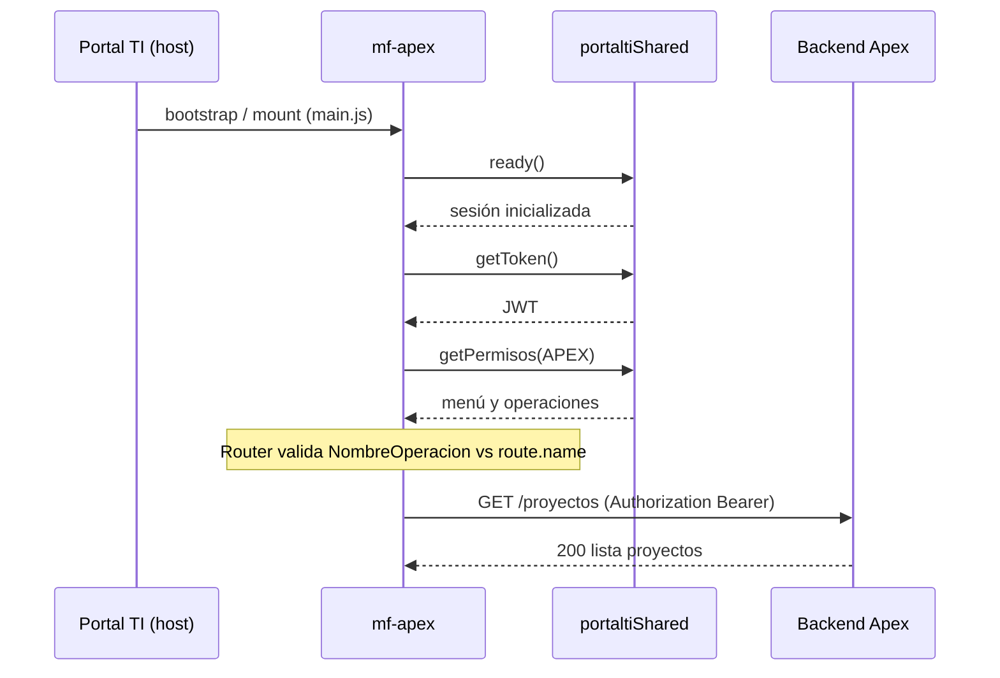
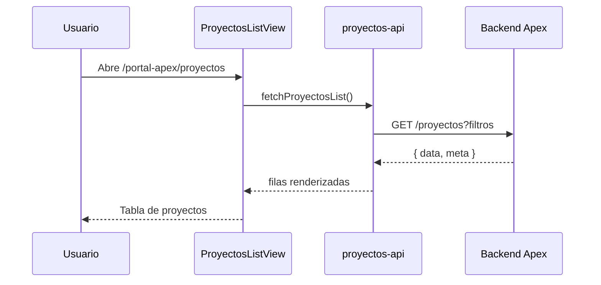
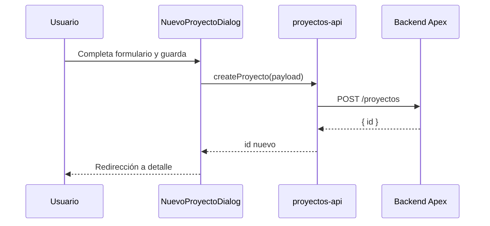
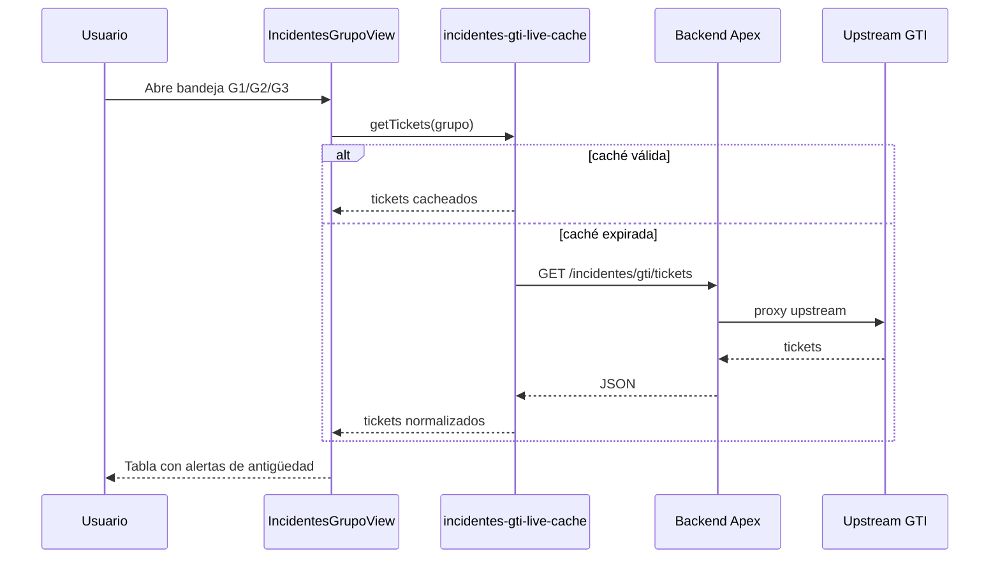
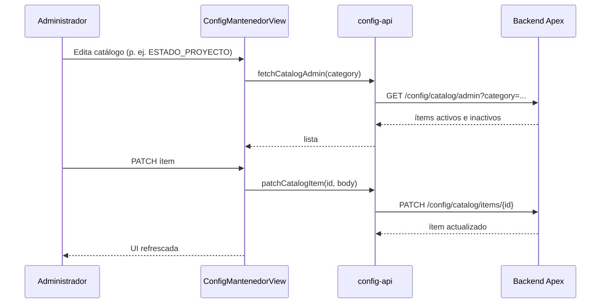

# Flujos del microfrontend

Rutas internas bajo base `/portal-apex`. Los diagramas describen la interacción entre usuario, MF, host Portal TI y backend Apex.

## Autenticación y montaje (single-spa)

## GET /proyectos

## POST /proyectos

## GET /incidentes/gti/tickets

## GET /config/catalog

